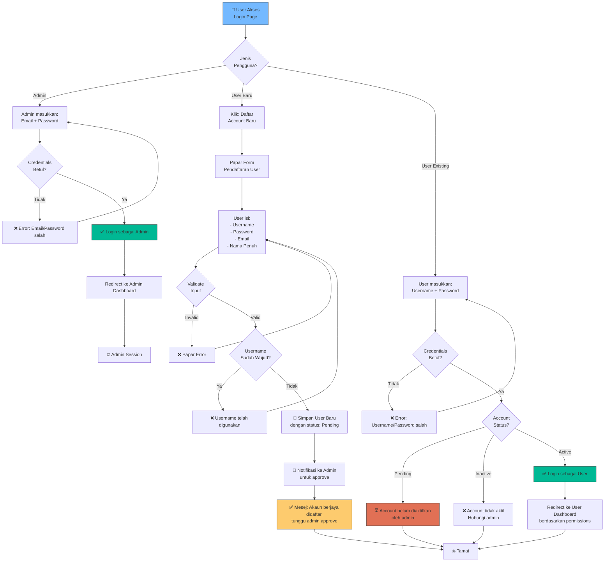
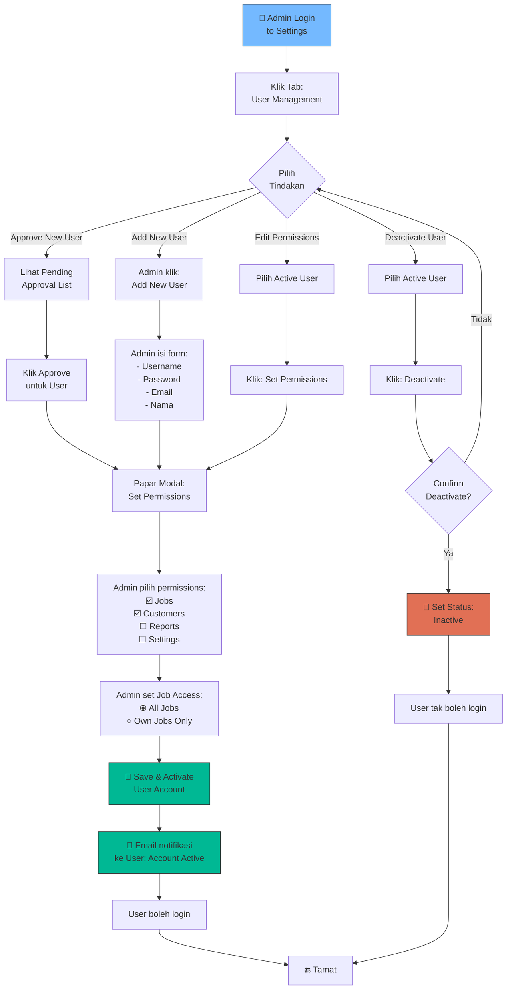
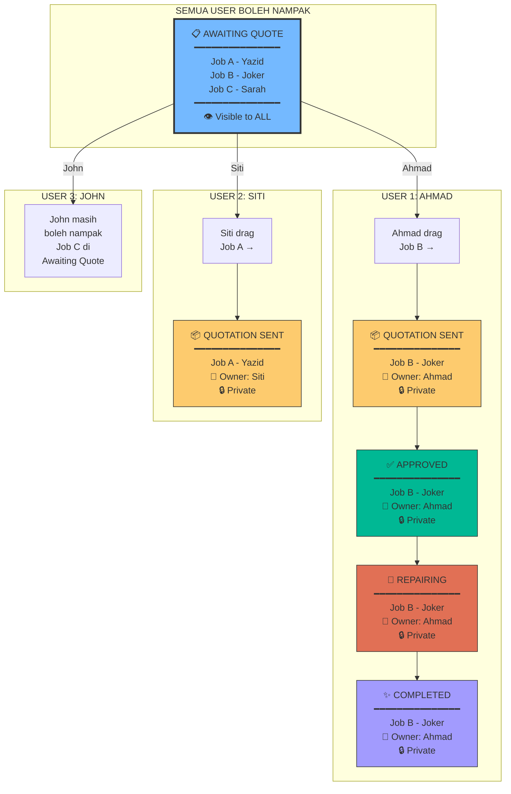
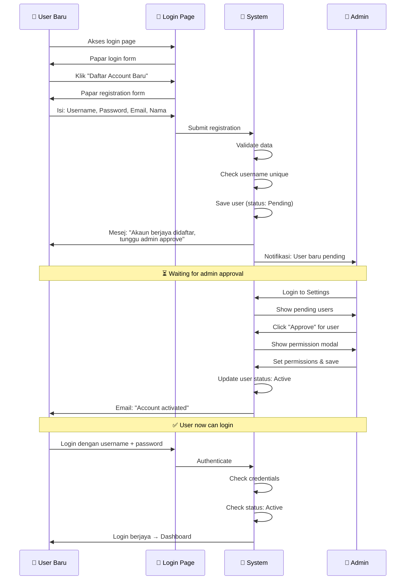
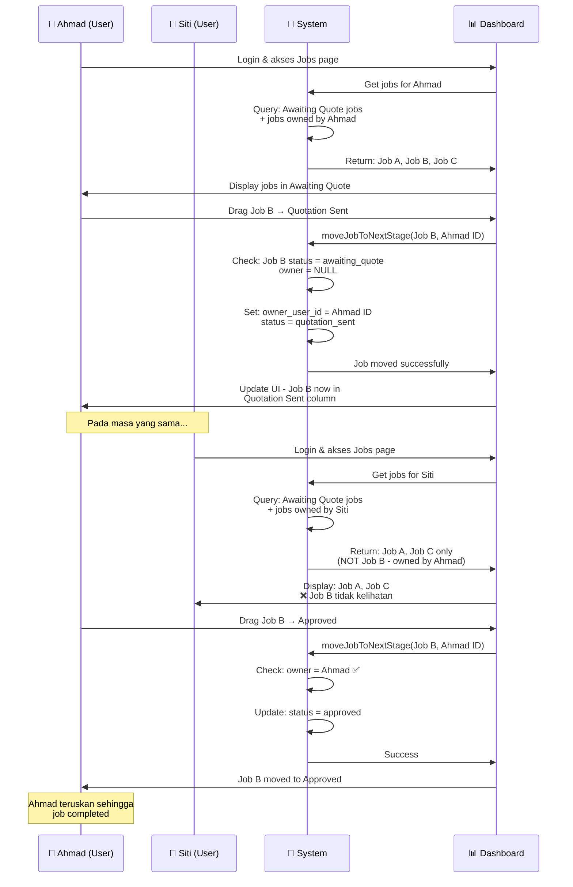

# Sistem Login & Pengurusan User - RepairCo WhatsApp Bot POS

## 📋 Gambaran Keseluruhan Sistem

Dokumentasi ini menerangkan aliran kerja untuk sistem login, pendaftaran user, pengurusan kebenaran oleh admin, dan kawalan job ownership untuk aplikasi **RepairCo WhatsApp Bot POS**.

### 🎯 Objektif Sistem
- **Multiple User Accounts**: Sokongan untuk Admin dan User berbilang
- **Self-Registration**: User boleh daftar sendiri 
- **Admin Control**: Admin mengurus user dan set permissions
- **Job Ownership**: Automatic job assignment dengan visibility control

---

## 1. Struktur Account Sistem

### 1.1 Jenis-jenis Account

```
┌─────────────────────────────────────────────┐
│         STRUKTUR ACCOUNT SISTEM             │
├─────────────────────────────────────────────┤
│                                             │
│  👑 ADMIN (Mandatory - Tetap)               │
│     • Email: admin@example.com              │
│     • Akses penuh semua fungsi              │
│     • Mengurus user lain                    │
│     • Set permissions                       │
│                                             │
│  👤 USER (Boleh Daftar Sendiri/Admin)       │
│     • Akses berdasarkan permissions         │
│     • Boleh process jobs                    │
│     • Tak boleh urus user lain              │
│                                             │
└─────────────────────────────────────────────┘
```

### 1.2 Perbezaan Admin vs User

| Aspek | 👑 Admin | 👤 User |
|-------|----------|---------|
| **Account Creation** | Tetap (Mandatory) | Self-register / Admin create |
| **Login Page** | Email + Password | Username + Password |
| **Dashboard Access** | ✅ Penuh | Berdasarkan permissions |
| **User Management** | ✅ Boleh create/edit users | ❌ Tidak |
| **Permissions Setting** | ✅ Boleh set permissions | ❌ Tidak |
| **Job Visibility** | ✅ Semua jobs | Hanya jobs sendiri |
| **Settings Access** | ✅ Semua settings | ❌ Profil sendiri sahaja |

---

## 2. Aliran Kerja Login System

### 2.1 Carta Alir Login Page (Screenshot 3)



### 2.2 Mock-up Login Page (Tambahan untuk Screenshot 3)

```
╔═══════════════════════════════════════════════════════════╗
║                    🔐 REPAIRCO POS                        ║
║                   WhatsApp Bot POS                        ║
╠═══════════════════════════════════════════════════════════╣
║                                                           ║
║  ┌─────────────────────────────────────────────────────┐ ║
║  │  Login Type:                                        │ ║
║  │  ⦿ Admin    ○ User                                  │ ║
║  └─────────────────────────────────────────────────────┘ ║
║                                                           ║
║  ┌─────────────────────────────────────────────────────┐ ║
║  │  📧 Email / Username                                 │ ║
║  │  admin@example.com                                  │ ║
║  └─────────────────────────────────────────────────────┘ ║
║                                                           ║
║  ┌─────────────────────────────────────────────────────┐ ║
║  │  🔒 Password                                         │ ║
║  │  ••••••••                                  👁️       │ ║
║  └─────────────────────────────────────────────────────┘ ║
║                                                           ║
║            Forgot password?                               ║
║                                                           ║
║  ┌─────────────────────────────────────────────────────┐ ║
║  │             Sign In  →                              │ ║
║  └─────────────────────────────────────────────────────┘ ║
║                                                           ║
║  ┌─────────────────────────────────────────────────────┐ ║
║  │         ➕ Daftar Account User Baru                  │ ║
║  └─────────────────────────────────────────────────────┘ ║
║                                                           ║
║            Need help? Read the documentation              ║
╚═══════════════════════════════════════════════════════════╝
```

### 2.3 Form Pendaftaran User Baru

```
╔═══════════════════════════════════════════════════════════╗
║              📝 DAFTAR ACCOUNT USER BARU                  ║
╠═══════════════════════════════════════════════════════════╣
║                                                           ║
║  ┌─────────────────────────────────────────────────────┐ ║
║  │  👤 Username                                         │ ║
║  │  (untuk login, contoh: ahmad.ali)                   │ ║
║  │  ________________________________________            │ ║
║  └─────────────────────────────────────────────────────┘ ║
║                                                           ║
║  ┌─────────────────────────────────────────────────────┐ ║
║  │  🔒 Password                                         │ ║
║  │  (minimum 6 aksara)                                 │ ║
║  │  ________________________________________            │ ║
║  └─────────────────────────────────────────────────────┘ ║
║                                                           ║
║  ┌─────────────────────────────────────────────────────┐ ║
║  │  🔒 Confirm Password                                 │ ║
║  │  ________________________________________            │ ║
║  └─────────────────────────────────────────────────────┘ ║
║                                                           ║
║  ┌─────────────────────────────────────────────────────┐ ║
║  │  📧 Email                                            │ ║
║  │  ________________________________________            │ ║
║  └─────────────────────────────────────────────────────┘ ║
║                                                           ║
║  ┌─────────────────────────────────────────────────────┐ ║
║  │  📝 Nama Penuh                                       │ ║
║  │  ________________________________________            │ ║
║  └─────────────────────────────────────────────────────┘ ║
║                                                           ║
║  ┌─────────────────────────────────────────────────────┐ ║
║  │  📞 No. Telefon (Optional)                           │ ║
║  │  ________________________________________            │ ║
║  └─────────────────────────────────────────────────────┘ ║
║                                                           ║
║  ⚠️ Nota: Account anda akan pending sehingga admin       ║
║           approve dan set permissions.                    ║
║                                                           ║
║  ┌──────────────────────┐  ┌──────────────────────────┐ ║
║  │   ❌ Cancel          │  │   ✅ Daftar Account      │ ║
║  └──────────────────────┘  └──────────────────────────┘ ║
║                                                           ║
╚═══════════════════════════════════════════════════════════╝
```

---

## 3. Pengurusan User di Settings (Screenshot 2)

### 3.1 Tambahan untuk Settings Page - User Management Tab

```
╔═══════════════════════════════════════════════════════════════╗
║                  ⚙️ APPLICATION SETTINGS                      ║
╠═══════════════════════════════════════════════════════════════╣
║                                                               ║
║  [General] [WhatsApp] [AI & Automation] [Backup] [👥 Users]  ║
║  ────────────────────────────────────────────────────────     ║
║                                                               ║
║  👥 User Management                                           ║
║  ═══════════════════════════════════════════════════════      ║
║                                                               ║
║  ┌─────────────────────────────────────────────────────────┐ ║
║  │  🔍 Search users...                     ➕ Add New User │ ║
║  └─────────────────────────────────────────────────────────┘ ║
║                                                               ║
║  ┌─────────────────────────────────────────────────────────┐ ║
║  │ PENDING APPROVAL (2)                                    │ ║
║  ├─────────────────────────────────────────────────────────┤ ║
║  │ 👤 ahmad.ali                                            │ ║
║  │    📧 ahmad@email.com | 📅 Daftar: 14/12/2024           │ ║
║  │    [✅ Approve] [❌ Reject] [👁️ View Details]           │ ║
║  ├─────────────────────────────────────────────────────────┤ ║
║  │ 👤 siti.aminah                                          │ ║
║  │    📧 siti@email.com | 📅 Daftar: 15/12/2024            │ ║
║  │    [✅ Approve] [❌ Reject] [👁️ View Details]           │ ║
║  └─────────────────────────────────────────────────────────┘ ║
║                                                               ║
║  ┌─────────────────────────────────────────────────────────┐ ║
║  │ ACTIVE USERS (5)                                        │ ║
║  ├─────────────────────────────────────────────────────────┤ ║
║  │ 👤 john.tan          ✅ Active                          │ ║
║  │    📧 john@email.com                                    │ ║
║  │    🔑 Permissions: Jobs, Customers, Devices             │ ║
║  │    [✏️ Edit] [🔑 Set Permissions] [🔒 Deactivate]       │ ║
║  ├─────────────────────────────────────────────────────────┤ ║
║  │ 👤 mary.lee          ✅ Active                          │ ║
║  │    📧 mary@email.com                                    │ ║
║  │    🔑 Permissions: Jobs, Reports (View Only)            │ ║
║  │    [✏️ Edit] [🔑 Set Permissions] [🔒 Deactivate]       │ ║
║  └─────────────────────────────────────────────────────────┘ ║
║                                                               ║
║  ┌─────────────────────────────────────────────────────────┐ ║
║  │ INACTIVE USERS (1)                                      │ ║
║  ├─────────────────────────────────────────────────────────┤ ║
║  │ 👤 david.wong        ❌ Inactive                        │ ║
║  │    📧 david@email.com                                   │ ║
║  │    [✅ Activate] [🗑️ Delete]                            │ ║
║  └─────────────────────────────────────────────────────────┘ ║
║                                                               ║
╚═══════════════════════════════════════════════════════════════╝
```

### 3.2 Carta Alir Admin Mengurus User



### 3.3 Modal Set Permissions untuk User

```
╔═══════════════════════════════════════════════════════════╗
║            🔑 SET USER PERMISSIONS                        ║
╠═══════════════════════════════════════════════════════════╣
║                                                           ║
║  User: ahmad.ali (Ahmad bin Ali)                          ║
║  Email: ahmad@email.com                                   ║
║                                                           ║
║  ─────────────────────────────────────────────────────    ║
║  MODULE ACCESS                                            ║
║  ─────────────────────────────────────────────────────    ║
║                                                           ║
║  ☑️ Jobs Management                                       ║
║     └─ ⦿ Can view all jobs                               ║
║        ○ Can view own jobs only                          ║
║                                                           ║
║  ☑️ Customers                                             ║
║     └─ ☑️ View    ☑️ Edit    ☑️ Add    ☐ Delete          ║
║                                                           ║
║  ☑️ Devices                                               ║
║     └─ ☑️ View    ☑️ Edit    ☑️ Add    ☐ Delete          ║
║                                                           ║
║  ☐ Reports                                                ║
║     └─ ☐ View    ☐ Export                                ║
║                                                           ║
║  ☐ Settings                                               ║
║     └─ ☐ View    ☐ Edit                                  ║
║                                                           ║
║  ☐ Campaigns                                              ║
║     └─ ☐ View    ☐ Create    ☐ Send                      ║
║                                                           ║
║  ─────────────────────────────────────────────────────    ║
║  JOB WORKFLOW PERMISSIONS                                 ║
║  ─────────────────────────────────────────────────────    ║
║                                                           ║
║  ☑️ Can move job: Awaiting Quote → Quotation Sent        ║
║  ☑️ Can move job: Quotation Sent → Approved               ║
║  ☑️ Can move job: Approved → Repairing                    ║
║  ☑️ Can move job: Repairing → Completed                   ║
║  ☐ Can delete jobs                                        ║
║  ☐ Can edit other user's jobs                             ║
║                                                           ║
║  ┌──────────────────────┐  ┌──────────────────────────┐  ║
║  │   ❌ Cancel          │  │   💾 Save Permissions    │  ║
║  └──────────────────────┘  └──────────────────────────┘  ║
║                                                           ║
╚═══════════════════════════════════════════════════════════╝
```

---

## 4. Job Ownership & Visibility System (Screenshot 1)

### 4.1 Konsep Job Ownership

**Peraturan Asas:**
1. **Awaiting Quote**: Semua user boleh nampak SEMUA jobs
2. **Bila user drag job ke stage seterusnya**: Job jadi milik user tu (Job Owner)
3. **Selepas drag**: Hanya job owner sahaja boleh nampak & process job tu
4. **User lain**: Tak nampak job yang dah diambil user lain

```
┌────────────────────────────────────────────────────────────┐
│                   JOB VISIBILITY FLOW                      │
├────────────────────────────────────────────────────────────┤
│                                                            │
│  STAGE 1: AWAITING QUOTE                                   │
│  ┌──────────────────────────────────────────────────────┐ │
│  │  👁️ VISIBILITY: PUBLIC (Semua user nampak)           │ │
│  │                                                       │ │
│  │  Job A - Printer HP Laserjet (Yazid)                 │ │
│  │  Job B - Phone Asus Xenphone 15 (Joker)              │ │
│  │  Job C - Laptop Dell Inspiron (Sarah)                │ │
│  │                                                       │ │
│  │  ✅ Ahmad (User 1) boleh nampak: Job A, B, C         │ │
│  │  ✅ Siti (User 2) boleh nampak: Job A, B, C          │ │
│  │  ✅ John (User 3) boleh nampak: Job A, B, C          │ │
│  └──────────────────────────────────────────────────────┘ │
│                           ↓                                │
│              Ahmad drag Job B →                            │
│                           ↓                                │
│  STAGE 2: QUOTATION SENT                                   │
│  ┌──────────────────────────────────────────────────────┐ │
│  │  🔒 VISIBILITY: PRIVATE (Owner sahaja)                │ │
│  │                                                       │ │
│  │  Job B - Phone Asus Xenphone 15 (Joker)              │ │
│  │  👤 Owner: Ahmad                                      │ │
│  │                                                       │ │
│  │  ✅ Ahmad (Owner) - NAMPAK Job B                      │ │
│  │  ❌ Siti - TAK NAMPAK Job B                           │ │
│  │  ❌ John - TAK NAMPAK Job B                           │ │
│  └──────────────────────────────────────────────────────┘ │
│                           ↓                                │
│              (Seterusnya sama untuk semua stages)          │
│                                                            │
└────────────────────────────────────────────────────────────┘
```

### 4.2 Carta Alir Job Workflow dengan Ownership



### 4.3 Database Schema untuk Job Ownership

```sql
-- Tambahan field dalam table jobs
CREATE TABLE jobs (
    id INT PRIMARY KEY AUTO_INCREMENT,
    job_number VARCHAR(50) UNIQUE,
    customer_name VARCHAR(100),
    device_name VARCHAR(100),
    status ENUM('awaiting_quote', 'quotation_sent', 'approved', 'repairing', 'completed'),
    
    -- FIELD BARU UNTUK OWNERSHIP
    owner_user_id INT NULL,  -- NULL = semua boleh nampak (Awaiting Quote)
                             -- Value = hanya owner boleh nampak
    assigned_date DATETIME NULL,  -- Tarikh job di-assign kepada user
    
    created_at DATETIME,
    updated_at DATETIME,
    
    FOREIGN KEY (owner_user_id) REFERENCES users(id)
);

-- Contoh data
INSERT INTO jobs VALUES (
    1, 
    'JOB-001', 
    'Joker', 
    'Phone Asus Xenphone 15',
    'quotation_sent',
    5,  -- User ID 5 (Ahmad) adalah owner
    '2024-12-15 10:30:00',
    '2024-12-15 09:00:00',
    '2024-12-15 10:30:00'
);
```

### 4.4 Logik Visibility dalam Kod (Pseudo-code)

```javascript
// Function untuk fetch jobs berdasarkan user login
function getJobsForUser(userId, userRole) {
    let query = "SELECT * FROM jobs WHERE ";
    
    if (userRole === 'admin') {
        // Admin nampak semua jobs
        query += "1=1";
    } else {
        // User biasa
        query += `
            (status = 'awaiting_quote' AND owner_user_id IS NULL)
            OR 
            (owner_user_id = ${userId})
        `;
        // Maksudnya:
        // 1. Jobs di Awaiting Quote yang belum ada owner
        // 2. Jobs yang user ni adalah owner
    }
    
    return database.execute(query);
}

// Function bila user drag job ke stage baru
function moveJobToNextStage(jobId, userId, newStatus) {
    const job = getJob(jobId);
    
    // Jika job di Awaiting Quote (belum ada owner)
    if (job.status === 'awaiting_quote' && job.owner_user_id === null) {
        // Set user sebagai owner bila drag ke stage pertama
        if (newStatus === 'quotation_sent') {
            updateJob(jobId, {
                status: newStatus,
                owner_user_id: userId,  // SET OWNER
                assigned_date: new Date()
            });
            
            logActivity(userId, `Mengambil job ${job.job_number}`);
        }
    } 
    // Jika job dah ada owner
    else if (job.owner_user_id !== null) {
        // Hanya owner boleh move job
        if (job.owner_user_id === userId) {
            updateJob(jobId, {
                status: newStatus
            });
            
            logActivity(userId, `Move job ${job.job_number} to ${newStatus}`);
        } else {
            throw new Error('Anda bukan owner job ini');
        }
    }
}
```

### 4.5 Contoh UI Job Board untuk Different Users

**View untuk Ahmad (selepas dia drag Job B):**
```
╔═══════════════════════════════════════════════════════════════════════════╗
║  🏠 REPAIR JOBS WORKFLOW - Login as: Ahmad (User)                        ║
╠═══════════════════════════════════════════════════════════════════════════╣
║                                                                           ║
║  📋 AWAITING    📦 QUOTATION   ✅ APPROVED    🔧 REPAIRING   ✨ COMPLETED ║
║     QUOTE (2)      SENT (1)       (0)           (0)            (0)       ║
║  ─────────────  ─────────────  ────────────  ─────────────  ──────────── ║
║                                                                           ║
║  ┌──────────┐   ┌──────────┐                                             ║
║  │ Job A    │   │ Job B 👤 │   Drop here     Drop here     Drop here     ║
║  │ Yazid    │   │ Joker    │                                             ║
║  │ Printer  │   │ Asus     │                                             ║
║  └──────────┘   │ Phone    │                                             ║
║                 │ Normal   │                                             ║
║  ┌──────────┐   └──────────┘                                             ║
║  │ Job C    │                                                             ║
║  │ Sarah    │   👁️ Ahmad                                                 ║
║  │ Laptop   │   sahaja                                                   ║
║  └──────────┘   nampak                                                   ║
║                                                                           ║
╚═══════════════════════════════════════════════════════════════════════════╝
```

**View untuk Siti (user lain):**
```
╔═══════════════════════════════════════════════════════════════════════════╗
║  🏠 REPAIR JOBS WORKFLOW - Login as: Siti (User)                         ║
╠═══════════════════════════════════════════════════════════════════════════╣
║                                                                           ║
║  📋 AWAITING    📦 QUOTATION   ✅ APPROVED    🔧 REPAIRING   ✨ COMPLETED ║
║     QUOTE (2)      SENT (0)       (0)           (0)            (0)       ║
║  ─────────────  ─────────────  ────────────  ─────────────  ──────────── ║
║                                                                           ║
║  ┌──────────┐                                                             ║
║  │ Job A    │   Drop here     Drop here     Drop here     Drop here      ║
║  │ Yazid    │                                                             ║
║  │ Printer  │   ❌ Siti tak                                               ║
║  └──────────┘   nampak Job B                                             ║
║                                                                           ║
║  ┌──────────┐   (Job B dah                                               ║
║  │ Job C    │   diambil oleh                                             ║
║  │ Sarah    │   Ahmad)                                                   ║
║  │ Laptop   │                                                             ║
║  └──────────┘                                                             ║
║                                                                           ║
╚═══════════════════════════════════════════════════════════════════════════╝
```

**View untuk Admin (boleh nampak semua):**
```
╔═══════════════════════════════════════════════════════════════════════════╗
║  🏠 REPAIR JOBS WORKFLOW - Login as: Admin                               ║
╠═══════════════════════════════════════════════════════════════════════════╣
║                                                                           ║
║  📋 AWAITING    📦 QUOTATION   ✅ APPROVED    🔧 REPAIRING   ✨ COMPLETED ║
║     QUOTE (2)      SENT (1)       (0)           (0)            (0)       ║
║  ─────────────  ─────────────  ────────────  ─────────────  ──────────── ║
║                                                                           ║
║  ┌──────────┐   ┌──────────┐                                             ║
║  │ Job A    │   │ Job B    │   Drop here     Drop here     Drop here     ║
║  │ Yazid    │   │ 👤 Ahmad │                                             ║
║  │ Printer  │   │ Joker    │                                             ║
║  └──────────┘   │ Asus     │   ✅ Admin                                  ║
║                 │ Phone    │   boleh nampak                              ║
║  ┌──────────┐   │ Normal   │   semua jobs                                ║
║  │ Job C    │   └──────────┘   termasuk                                  ║
║  │ Sarah    │                  yang dah                                  ║
║  │ Laptop   │                  ada owner                                 ║
║  └──────────┘                                                             ║
║                                                                           ║
╚═══════════════════════════════════════════════════════════════════════════╝
```

---

## 5. Complete User Journey Flow

### 5.1 Journey 1: User Baru Self-Register



### 5.2 Journey 2: User Mengambil dan Process Job



---

## 6. Implementation Checklist

### 6.1 Frontend Changes (Login Page - Screenshot 3)

```
✅ CHECKLIST - LOGIN PAGE MODIFICATION

☐ 1. Tambah Toggle untuk Login Type
     └─ Radio buttons: Admin / User
     
☐ 2. Dynamic Form Fields
     └─ Admin: Email + Password
     └─ User: Username + Password
     
☐ 3. Tambah Button "Daftar Account User Baru"
     └─ Below Sign In button
     
☐ 4. Create Registration Modal/Page
     ├─ Field: Username (required, unique)
     ├─ Field: Password (required, min 6 chars)
     ├─ Field: Confirm Password (required, must match)
     ├─ Field: Email (required, valid email)
     ├─ Field: Nama Penuh (required)
     ├─ Field: No. Telefon (optional)
     ├─ Validation logic
     └─ Submit handler
     
☐ 5. Show Success/Error Messages
     └─ After registration submission
     
☐ 6. Handle Login for Different User Types
     ├─ Admin: Check admin credentials table
     ├─ User: Check users table
     └─ Check account status before login
```

### 6.2 Backend Changes (Settings - Screenshot 2)

```
✅ CHECKLIST - SETTINGS PAGE MODIFICATION

☐ 1. Add "Users" Tab in Settings
     └─ New tab alongside General, WhatsApp, etc.
     
☐ 2. User Management Interface
     ├─ Section: Pending Approval
     ├─ Section: Active Users  
     ├─ Section: Inactive Users
     └─ Search functionality
     
☐ 3. Approve User Flow
     ├─ Approve button
     ├─ Show permissions modal
     ├─ Save permissions
     └─ Activate user
     
☐ 4. Create User Flow (by Admin)
     ├─ "Add New User" button
     ├─ User creation form
     └─ Auto-set permissions
     
☐ 5. Edit Permissions
     ├─ "Set Permissions" button
     ├─ Permissions modal
     └─ Update permissions
     
☐ 6. Deactivate/Delete User
     ├─ Deactivate button
     ├─ Confirmation dialog
     └─ Update user status
     
☐ 7. Notification System
     └─ Notify admin when new user registers
```

### 6.3 Database Changes

```
✅ CHECKLIST - DATABASE SCHEMA

☐ 1. Create/Update Users Table
CREATE TABLE users (
    id INT PRIMARY KEY AUTO_INCREMENT,
    username VARCHAR(50) UNIQUE NOT NULL,
    password_hash VARCHAR(255) NOT NULL,
    email VARCHAR(100) UNIQUE NOT NULL,
    full_name VARCHAR(100) NOT NULL,
    phone VARCHAR(20),
    status ENUM('pending', 'active', 'inactive') DEFAULT 'pending',
    created_at DATETIME DEFAULT CURRENT_TIMESTAMP,
    updated_at DATETIME DEFAULT CURRENT_TIMESTAMP ON UPDATE CURRENT_TIMESTAMP
);

☐ 2. Create Permissions Table
CREATE TABLE user_permissions (
    id INT PRIMARY KEY AUTO_INCREMENT,
    user_id INT NOT NULL,
    module VARCHAR(50) NOT NULL,  -- jobs, customers, devices, etc.
    can_view BOOLEAN DEFAULT FALSE,
    can_add BOOLEAN DEFAULT FALSE,
    can_edit BOOLEAN DEFAULT FALSE,
    can_delete BOOLEAN DEFAULT FALSE,
    FOREIGN KEY (user_id) REFERENCES users(id) ON DELETE CASCADE
);

☐ 3. Update Jobs Table
ALTER TABLE jobs ADD COLUMN owner_user_id INT NULL;
ALTER TABLE jobs ADD COLUMN assigned_date DATETIME NULL;
ALTER TABLE jobs ADD FOREIGN KEY (owner_user_id) 
    REFERENCES users(id) ON DELETE SET NULL;

☐ 4. Create Activity Log Table
CREATE TABLE activity_logs (
    id INT PRIMARY KEY AUTO_INCREMENT,
    user_id INT NOT NULL,
    action VARCHAR(100) NOT NULL,
    description TEXT,
    created_at DATETIME DEFAULT CURRENT_TIMESTAMP,
    FOREIGN KEY (user_id) REFERENCES users(id)
);
```

### 6.4 Jobs Board Changes (Screenshot 1)

```
✅ CHECKLIST - JOBS BOARD MODIFICATION

☐ 1. Modify Job Fetching Logic
     ├─ Check user role (admin/user)
     ├─ Filter jobs based on ownership
     └─ Return appropriate jobs
     
☐ 2. Implement Drag & Drop with Ownership
     ├─ On drag to Quotation Sent
     ├─ Set owner_user_id = current user
     ├─ Set assigned_date = now
     └─ Update job status
     
☐ 3. Restrict Drag for Non-Owners
     ├─ Check if job has owner
     ├─ Allow only owner to drag
     └─ Show error if non-owner tries
     
☐ 4. Visual Indicators
     ├─ Show owner badge on jobs
     ├─ Different colors for owned vs available jobs
     └─ Tooltips showing owner info
     
☐ 5. Real-time Updates
     ├─ When user drags job
     ├─ Remove from other users' view
     └─ Update board dynamically
```

### 6.5 API Endpoints Required

```
✅ CHECKLIST - API ENDPOINTS

Authentication:
☐ POST /api/auth/login
   └─ Handle both admin & user login

☐ POST /api/auth/register
   └─ User self-registration

☐ POST /api/auth/logout

User Management:
☐ GET /api/users/pending
   └─ Get pending approval users (admin only)

☐ GET /api/users/active
   └─ Get active users (admin only)

☐ POST /api/users/approve/:id
   └─ Approve pending user (admin only)

☐ POST /api/users/create
   └─ Admin creates user directly

☐ PUT /api/users/:id/permissions
   └─ Set user permissions (admin only)

☐ PUT /api/users/:id/deactivate
   └─ Deactivate user (admin only)

Jobs Management:
☐ GET /api/jobs
   └─ Get jobs based on user permissions & ownership

☐ PUT /api/jobs/:id/move
   └─ Move job to next stage (set ownership)

☐ GET /api/jobs/my-jobs
   └─ Get jobs owned by current user
```

---

## 7. Contoh Code Implementation

### 7.1 Frontend - Registration Form Component (React)

```jsx
import React, { useState } from 'react';
import axios from 'axios';

function UserRegistrationForm({ onClose, onSuccess }) {
    const [formData, setFormData] = useState({
        username: '',
        password: '',
        confirmPassword: '',
        email: '',
        fullName: '',
        phone: ''
    });
    
    const [errors, setErrors] = useState({});
    const [loading, setLoading] = useState(false);
    
    const handleChange = (e) => {
        setFormData({
            ...formData,
            [e.target.name]: e.target.value
        });
    };
    
    const validateForm = () => {
        const newErrors = {};
        
        if (!formData.username) {
            newErrors.username = 'Username diperlukan';
        } else if (formData.username.length < 3) {
            newErrors.username = 'Username minimum 3 aksara';
        }
        
        if (!formData.password) {
            newErrors.password = 'Password diperlukan';
        } else if (formData.password.length < 6) {
            newErrors.password = 'Password minimum 6 aksara';
        }
        
        if (formData.password !== formData.confirmPassword) {
            newErrors.confirmPassword = 'Password tidak sepadan';
        }
        
        if (!formData.email) {
            newErrors.email = 'Email diperlukan';
        } else if (!/\S+@\S+\.\S+/.test(formData.email)) {
            newErrors.email = 'Format email tidak sah';
        }
        
        if (!formData.fullName) {
            newErrors.fullName = 'Nama penuh diperlukan';
        }
        
        return newErrors;
    };
    
    const handleSubmit = async (e) => {
        e.preventDefault();
        
        const newErrors = validateForm();
        if (Object.keys(newErrors).length > 0) {
            setErrors(newErrors);
            return;
        }
        
        setLoading(true);
        
        try {
            const response = await axios.post('/api/auth/register', {
                username: formData.username,
                password: formData.password,
                email: formData.email,
                full_name: formData.fullName,
                phone: formData.phone
            });
            
            // Success
            alert('Akaun berjaya didaftarkan! Sila tunggu admin approve.');
            onSuccess();
            onClose();
            
        } catch (error) {
            if (error.response?.data?.error === 'username_exists') {
                setErrors({ username: 'Username telah digunakan' });
            } else if (error.response?.data?.error === 'email_exists') {
                setErrors({ email: 'Email telah digunakan' });
            } else {
                alert('Ralat berlaku. Sila cuba lagi.');
            }
        } finally {
            setLoading(false);
        }
    };
    
    return (
        <div className="modal">
            <div className="modal-content">
                <h2>📝 Daftar Account User Baru</h2>
                <form onSubmit={handleSubmit}>
                    <div className="form-group">
                        <label>👤 Username *</label>
                        <input
                            type="text"
                            name="username"
                            value={formData.username}
                            onChange={handleChange}
                            placeholder="contoh: ahmad.ali"
                        />
                        {errors.username && <span className="error">{errors.username}</span>}
                    </div>
                    
                    <div className="form-group">
                        <label>🔒 Password *</label>
                        <input
                            type="password"
                            name="password"
                            value={formData.password}
                            onChange={handleChange}
                            placeholder="Minimum 6 aksara"
                        />
                        {errors.password && <span className="error">{errors.password}</span>}
                    </div>
                    
                    <div className="form-group">
                        <label>🔒 Confirm Password *</label>
                        <input
                            type="password"
                            name="confirmPassword"
                            value={formData.confirmPassword}
                            onChange={handleChange}
                        />
                        {errors.confirmPassword && <span className="error">{errors.confirmPassword}</span>}
                    </div>
                    
                    <div className="form-group">
                        <label>📧 Email *</label>
                        <input
                            type="email"
                            name="email"
                            value={formData.email}
                            onChange={handleChange}
                        />
                        {errors.email && <span className="error">{errors.email}</span>}
                    </div>
                    
                    <div className="form-group">
                        <label>📝 Nama Penuh *</label>
                        <input
                            type="text"
                            name="fullName"
                            value={formData.fullName}
                            onChange={handleChange}
                        />
                        {errors.fullName && <span className="error">{errors.fullName}</span>}
                    </div>
                    
                    <div className="form-group">
                        <label>📞 No. Telefon</label>
                        <input
                            type="tel"
                            name="phone"
                            value={formData.phone}
                            onChange={handleChange}
                            placeholder="Optional"
                        />
                    </div>
                    
                    <div className="form-actions">
                        <button type="button" onClick={onClose} disabled={loading}>
                            ❌ Cancel
                        </button>
                        <button type="submit" disabled={loading}>
                            {loading ? '⏳ Processing...' : '✅ Daftar Account'}
                        </button>
                    </div>
                </form>
            </div>
        </div>
    );
}

export default UserRegistrationForm;
```

### 7.2 Backend - Job Filtering Logic (Node.js)

```javascript
// jobsController.js

const db = require('../config/database');

// Get jobs based on user role and permissions
async function getJobsForUser(req, res) {
    try {
        const userId = req.user.id;
        const userRole = req.user.role; // 'admin' or 'user'
        
        let query = `
            SELECT 
                j.*,
                u.username as owner_username,
                u.full_name as owner_name
            FROM jobs j
            LEFT JOIN users u ON j.owner_user_id = u.id
            WHERE 1=1
        `;
        
        const params = [];
        
        if (userRole !== 'admin') {
            // User biasa - filter based on visibility rules
            query += `
                AND (
                    (j.status = 'awaiting_quote' AND j.owner_user_id IS NULL)
                    OR 
                    j.owner_user_id = ?
                )
            `;
            params.push(userId);
        }
        // Admin nampak semua jobs - no additional filter
        
        query += ` ORDER BY j.created_at DESC`;
        
        const [jobs] = await db.execute(query, params);
        
        res.json({
            success: true,
            jobs: jobs
        });
        
    } catch (error) {
        console.error('Error fetching jobs:', error);
        res.status(500).json({
            success: false,
            error: 'Failed to fetch jobs'
        });
    }
}

// Move job to next stage
async function moveJob(req, res) {
    try {
        const { id } = req.params;
        const { newStatus } = req.body;
        const userId = req.user.id;
        const userRole = req.user.role;
        
        // Get current job
        const [jobs] = await db.execute(
            'SELECT * FROM jobs WHERE id = ?',
            [id]
        );
        
        if (jobs.length === 0) {
            return res.status(404).json({
                success: false,
                error: 'Job not found'
            });
        }
        
        const job = jobs[0];
        
        // Check permissions
        if (userRole !== 'admin') {
            // If job is in Awaiting Quote and being moved to Quotation Sent
            if (job.status === 'awaiting_quote' && 
                newStatus === 'quotation_sent' && 
                job.owner_user_id === null) {
                
                // Assign job to current user
                await db.execute(
                    `UPDATE jobs 
                     SET status = ?, 
                         owner_user_id = ?, 
                         assigned_date = NOW(),
                         updated_at = NOW()
                     WHERE id = ?`,
                    [newStatus, userId, id]
                );
                
                // Log activity
                await db.execute(
                    `INSERT INTO activity_logs (user_id, action, description)
                     VALUES (?, ?, ?)`,
                    [userId, 'JOB_ASSIGNED', `Mengambil job ${job.job_number}`]
                );
                
                return res.json({
                    success: true,
                    message: 'Job berjaya dipindahkan dan di-assign kepada anda'
                });
                
            } 
            // If job already has owner
            else if (job.owner_user_id !== null) {
                
                // Check if current user is the owner
                if (job.owner_user_id !== userId) {
                    return res.status(403).json({
                        success: false,
                        error: 'Anda bukan owner job ini'
                    });
                }
                
                // Owner can move their job
                await db.execute(
                    `UPDATE jobs 
                     SET status = ?, 
                         updated_at = NOW()
                     WHERE id = ?`,
                    [newStatus, id]
                );
                
                // Log activity
                await db.execute(
                    `INSERT INTO activity_logs (user_id, action, description)
                     VALUES (?, ?, ?)`,
                    [userId, 'JOB_MOVED', `Move job ${job.job_number} to ${newStatus}`]
                );
                
                return res.json({
                    success: true,
                    message: 'Job berjaya dipindahkan'
                });
            }
        } else {
            // Admin can move any job
            await db.execute(
                `UPDATE jobs 
                 SET status = ?, 
                     updated_at = NOW()
                 WHERE id = ?`,
                [newStatus, id]
            );
            
            return res.json({
                success: true,
                message: 'Job berjaya dipindahkan (Admin)'
            });
        }
        
    } catch (error) {
        console.error('Error moving job:', error);
        res.status(500).json({
            success: false,
            error: 'Failed to move job'
        });
    }
}

module.exports = {
    getJobsForUser,
    moveJob
};
```

### 7.3 Frontend - Jobs Board with Ownership Display

```jsx
import React, { useState, useEffect } from 'react';
import { DragDropContext, Droppable, Draggable } from 'react-beautiful-dnd';
import axios from 'axios';

function JobsBoard() {
    const [jobs, setJobs] = useState({
        awaiting_quote: [],
        quotation_sent: [],
        approved: [],
        repairing: [],
        completed: []
    });
    
    const [currentUser, setCurrentUser] = useState(null);
    
    useEffect(() => {
        fetchJobs();
        fetchCurrentUser();
    }, []);
    
    const fetchJobs = async () => {
        try {
            const response = await axios.get('/api/jobs');
            
            // Group jobs by status
            const groupedJobs = {
                awaiting_quote: [],
                quotation_sent: [],
                approved: [],
                repairing: [],
                completed: []
            };
            
            response.data.jobs.forEach(job => {
                if (groupedJobs[job.status]) {
                    groupedJobs[job.status].push(job);
                }
            });
            
            setJobs(groupedJobs);
        } catch (error) {
            console.error('Error fetching jobs:', error);
        }
    };
    
    const fetchCurrentUser = async () => {
        try {
            const response = await axios.get('/api/auth/me');
            setCurrentUser(response.data.user);
        } catch (error) {
            console.error('Error fetching current user:', error);
        }
    };
    
    const onDragEnd = async (result) => {
        const { source, destination, draggableId } = result;
        
        // Dropped outside the list
        if (!destination) return;
        
        // Same position
        if (source.droppableId === destination.droppableId && 
            source.index === destination.index) {
            return;
        }
        
        try {
            // Call API to move job
            await axios.put(`/api/jobs/${draggableId}/move`, {
                newStatus: destination.droppableId
            });
            
            // Refresh jobs after successful move
            fetchJobs();
            
        } catch (error) {
            alert(error.response?.data?.error || 'Gagal memindahkan job');
            console.error('Error moving job:', error);
        }
    };
    
    const renderJob = (job, index) => {
        const isOwner = job.owner_user_id === currentUser?.id;
        const isAdmin = currentUser?.role === 'admin';
        
        return (
            <Draggable key={job.id} draggableId={job.id.toString()} index={index}>
                {(provided, snapshot) => (
                    <div
                        ref={provided.innerRef}
                        {...provided.draggableProps}
                        {...provided.dragHandleProps}
                        className={`job-card ${snapshot.isDragging ? 'dragging' : ''} 
                                   ${isOwner ? 'owned-by-me' : ''}`}
                    >
                        <h4>{job.device_name}</h4>
                        <p>👤 {job.customer_name}</p>
                        <p>📅 {new Date(job.created_at).toLocaleDateString()}</p>
                        
                        {job.owner_user_id && (
                            <div className="owner-badge">
                                {isOwner ? (
                                    <span className="badge-mine">🔒 Job Saya</span>
                                ) : isAdmin ? (
                                    <span className="badge-admin">
                                        👤 Owner: {job.owner_name}
                                    </span>
                                ) : null}
                            </div>
                        )}
                        
                        {job.status === 'awaiting_quote' && !job.owner_user_id && (
                            <div className="available-badge">
                                ✨ Boleh diambil
                            </div>
                        )}
                        
                        <button className="view-btn">👁️ View</button>
                    </div>
                )}
            </Draggable>
        );
    };
    
    const statusColumns = [
        { id: 'awaiting_quote', title: '📋 Awaiting Quote', color: '#feca57' },
        { id: 'quotation_sent', title: '📦 Quotation Sent', color: '#48dbfb' },
        { id: 'approved', title: '✅ Approved', color: '#1dd1a1' },
        { id: 'repairing', title: '🔧 Repairing', color: '#ff9ff3' },
        { id: 'completed', title: '✨ Completed', color: '#a29bfe' }
    ];
    
    return (
        <div className="jobs-board">
            <div className="board-header">
                <h2>🔧 Repair Jobs Workflow</h2>
                <p>
                    Login as: <strong>{currentUser?.full_name}</strong> 
                    ({currentUser?.role === 'admin' ? '👑 Admin' : '👤 User'})
                </p>
            </div>
            
            <DragDropContext onDragEnd={onDragEnd}>
                <div className="board-columns">
                    {statusColumns.map(column => (
                        <div key={column.id} className="column">
                            <div 
                                className="column-header" 
                                style={{ backgroundColor: column.color }}
                            >
                                <h3>{column.title}</h3>
                                <span className="count">{jobs[column.id].length}</span>
                            </div>
                            
                            <Droppable droppableId={column.id}>
                                {(provided, snapshot) => (
                                    <div
                                        ref={provided.innerRef}
                                        {...provided.droppableProps}
                                        className={`column-content ${
                                            snapshot.isDraggingOver ? 'dragging-over' : ''
                                        }`}
                                    >
                                        {jobs[column.id].length > 0 ? (
                                            jobs[column.id].map((job, index) => 
                                                renderJob(job, index)
                                            )
                                        ) : (
                                            <div className="empty-column">
                                                Drop jobs here
                                            </div>
                                        )}
                                        {provided.placeholder}
                                    </div>
                                )}
                            </Droppable>
                        </div>
                    ))}
                </div>
            </DragDropContext>
        </div>
    );
}

export default JobsBoard;
```

---

## 8. Testing Scenarios

### 8.1 Test Case untuk User Registration

```
TEST CASE 1: User Baru Self-Register (Success)
──────────────────────────────────────────────
Precondition: Tiada account dengan username "testuser"

Steps:
1. Akses login page
2. Klik "Daftar Account User Baru"
3. Isi form:
   - Username: testuser
   - Password: Test123
   - Confirm Password: Test123
   - Email: testuser@email.com
   - Nama Penuh: Test User
4. Klik "Daftar Account"

Expected Result:
✅ Mesej success: "Akaun berjaya didaftar, tunggu admin approve"
✅ User record created dengan status: Pending
✅ Admin terima notifikasi
✅ User belum boleh login
```

```
TEST CASE 2: Username Already Exists
────────────────────────────────────
Precondition: Account dengan username "ahmad" sudah wujud

Steps:
1. Cuba daftar dengan username: ahmad

Expected Result:
❌ Error message: "Username telah digunakan"
✅ Form tidak submit
✅ User diminta tukar username
```

```
TEST CASE 3: Password Tidak Sepadan
───────────────────────────────────
Steps:
1. Password: Test123
2. Confirm Password: Test456
3. Submit form

Expected Result:
❌ Error: "Password tidak sepadan"
✅ Form tidak submit
```

### 8.2 Test Case untuk Admin Approve User

```
TEST CASE 4: Admin Approve User dengan Permissions
──────────────────────────────────────────────────
Precondition: Ada user pending approval

Steps:
1. Admin login
2. Pergi ke Settings > Users tab
3. Lihat "Pending Approval" section
4. Klik "Approve" untuk user
5. Set permissions:
   ☑️ Jobs Management
   ☑️ Customers (View, Edit, Add)
   ☑️ Devices (View, Add)
6. Klik "Save Permissions"

Expected Result:
✅ User status bertukar: Active
✅ Permissions tersimpan dalam database
✅ User terima email notification
✅ User boleh login
```

### 8.3 Test Case untuk Job Ownership

```
TEST CASE 5: User Drag Job dari Awaiting Quote
──────────────────────────────────────────────
Precondition: 
- User "Ahmad" login
- Ada job dalam Awaiting Quote (Job A)
- Job A belum ada owner

Steps:
1. Ahmad akses Jobs page
2. Nampak Job A dalam Awaiting Quote
3. Drag Job A ke Quotation Sent

Expected Result:
✅ Job A berpindah ke Quotation Sent
✅ Job A owner_user_id = Ahmad's ID
✅ assigned_date = current datetime
✅ Activity log created

Postcondition:
- User lain (Siti) login
- Siti TAK NAMPAK Job A lagi
- Ahmad sahaja nampak Job A
```

```
TEST CASE 6: User Cuba Move Job Orang Lain
──────────────────────────────────────────
Precondition:
- Job B owner = Ahmad
- User "Siti" login

Steps:
1. Siti cuba drag Job B (tidak sepatutnya nampak pun)
2. Atau Siti cuba access Job B via API

Expected Result:
❌ Siti tidak nampak Job B dalam dashboard
❌ Jika cuba force via API: Error 403 Forbidden
✅ Mesej: "Anda bukan owner job ini"
```

```
TEST CASE 7: Admin Boleh Nampak Semua Jobs
──────────────────────────────────────────
Precondition:
- Job A owner = Ahmad
- Job B owner = Siti  
- Job C tiada owner (Awaiting Quote)
- Admin login

Steps:
1. Admin akses Jobs page

Expected Result:
✅ Admin nampak Job A (milik Ahmad)
✅ Admin nampak Job B (milik Siti)
✅ Admin nampak Job C (belum ada owner)
✅ Semua jobs visible to admin
✅ Owner info ditunjukkan pada job card
```

---

## 9. Security Considerations

### 9.1 Security Checklist

```
🔒 SECURITY CHECKLIST

☑️ 1. Password Security
    ├─ Hash password dengan bcrypt
    ├─ Minimum 6 characters
    ├─ Salt rounds: 10-12
    └─ Never store plain text password

☑️ 2. Authentication
    ├─ Use JWT tokens
    ├─ Set token expiry (24 hours)
    ├─ Store token securely (httpOnly cookie)
    └─ Implement refresh token mechanism

☑️ 3. Authorization
    ├─ Check user role before operations
    ├─ Verify job ownership before allowing actions
    ├─ Validate permissions from database
    └─ Never trust client-side role

☑️ 4. Input Validation
    ├─ Validate all user inputs (frontend & backend)
    ├─ Sanitize inputs to prevent SQL injection
    ├─ Use parameterized queries
    └─ Validate email format

☑️ 5. Session Management
    ├─ Implement session timeout
    ├─ Clear session on logout
    ├─ One active session per user (optional)
    └─ Log all authentication attempts

☑️ 6. API Security
    ├─ Require authentication for all protected routes
    ├─ Use HTTPS in production
    ├─ Implement rate limiting
    └─ Validate request origin (CORS)

☑️ 7. Data Protection
    ├─ Encrypt sensitive data at rest
    ├─ Use secure connection to database
    ├─ Regular database backups
    └─ Implement audit logging
```

### 9.2 Sample Security Middleware (Node.js)

```javascript
// middleware/auth.js

const jwt = require('jsonwebtoken');

// Verify JWT token
function authenticateToken(req, res, next) {
    const token = req.headers['authorization']?.split(' ')[1] ||
                  req.cookies.token;
    
    if (!token) {
        return res.status(401).json({
            success: false,
            error: 'Access token required'
        });
    }
    
    try {
        const decoded = jwt.verify(token, process.env.JWT_SECRET);
        req.user = decoded;
        next();
    } catch (error) {
        return res.status(403).json({
            success: false,
            error: 'Invalid or expired token'
        });
    }
}

// Check if user is admin
function requireAdmin(req, res, next) {
    if (req.user.role !== 'admin') {
        return res.status(403).json({
            success: false,
            error: 'Admin access required'
        });
    }
    next();
}

// Check job ownership
async function checkJobOwnership(req, res, next) {
    try {
        const jobId = req.params.id;
        const userId = req.user.id;
        const userRole = req.user.role;
        
        // Admin can access all jobs
        if (userRole === 'admin') {
            return next();
        }
        
        // Check if user owns the job
        const [jobs] = await db.execute(
            'SELECT * FROM jobs WHERE id = ? AND owner_user_id = ?',
            [jobId, userId]
        );
        
        if (jobs.length === 0) {
            return res.status(403).json({
                success: false,
                error: 'Anda bukan owner job ini'
            });
        }
        
        next();
        
    } catch (error) {
        res.status(500).json({
            success: false,
            error: 'Server error'
        });
    }
}

module.exports = {
    authenticateToken,
    requireAdmin,
    checkJobOwnership
};
```

---

## 10. Kesimpulan

Dokumentasi ini menerangkan sistem lengkap untuk:

### ✅ Sudah Dijelaskan:

1. **Login System**
   - Admin login (email + password)
   - User login (username + password)
   - Self-registration untuk user baru
   - Account activation oleh admin

2. **User Management**
   - Admin boleh approve/reject user baru
   - Admin boleh create user secara direct
   - Admin boleh set permissions untuk setiap user
   - Admin boleh deactivate/activate users

3. **Job Ownership System**
   - Semua user nampak jobs di "Awaiting Quote"
   - Bila user drag job, dia jadi owner
   - Hanya owner boleh nampak & process job selanjutnya
   - Admin boleh nampak semua jobs

4. **Permissions System**
   - Module-based permissions
   - Role-based access control
   - Granular control (view, add, edit, delete)

5. **Implementation Details**
   - Database schema
   - API endpoints
   - Frontend components
   - Backend logic
   - Security considerations

### 📝 Langkah Seterusnya:

1. Implement UI changes pada screenshot 2 & 3
2. Setup database tables
3. Create API endpoints
4. Implement authentication logic
5. Add job ownership tracking
6. Test thoroughly
7. Deploy

---

**Versi:** 2.0  
**Tarikh:** 15 Disember 2024  
**Status:** Complete specification based on actual requirements

---

## Appendix: Quick Reference

### User Roles
- **👑 Admin**: Full access, manages users & permissions
- **👤 User**: Limited access based on permissions, job ownership

### Job Stages
1. 📋 Awaiting Quote (Public - All can see)
2. 📦 Quotation Sent (Private - Owner only)
3. ✅ Approved (Private - Owner only)
4. 🔧 Repairing (Private - Owner only)
5. ✨ Completed (Private - Owner only)

### Key Database Tables
- `users` - User accounts
- `user_permissions` - Permissions mapping
- `jobs` - Repair jobs with ownership
- `activity_logs` - Audit trail

### Important URLs
- Login: `/login`
- Registration: `/login?register=true`
- Admin Settings: `/settings/users`
- Jobs Board: `/jobs`
